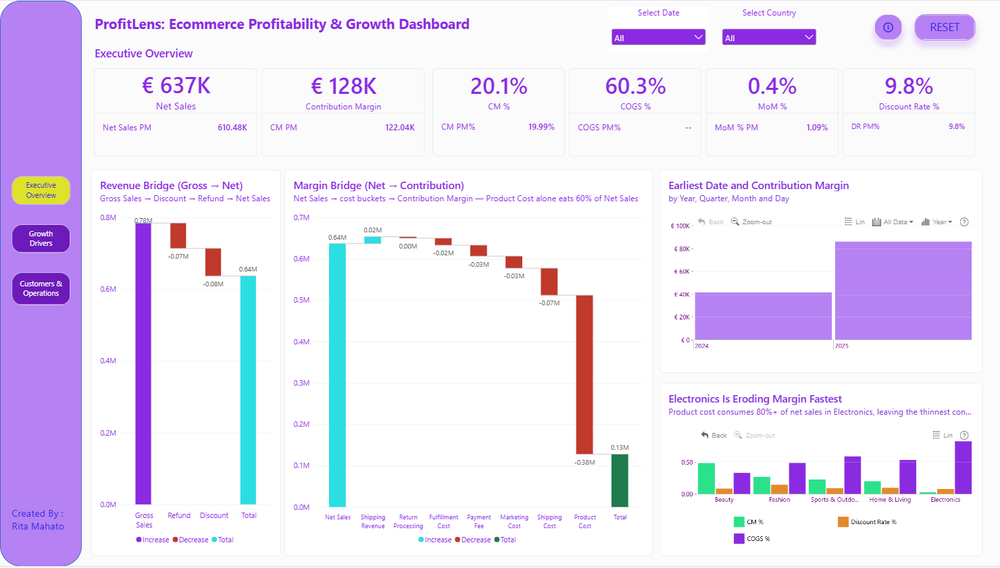
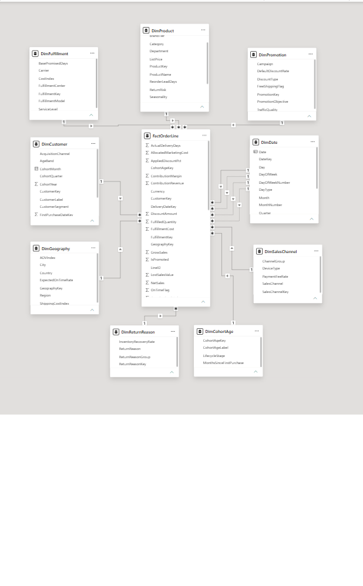
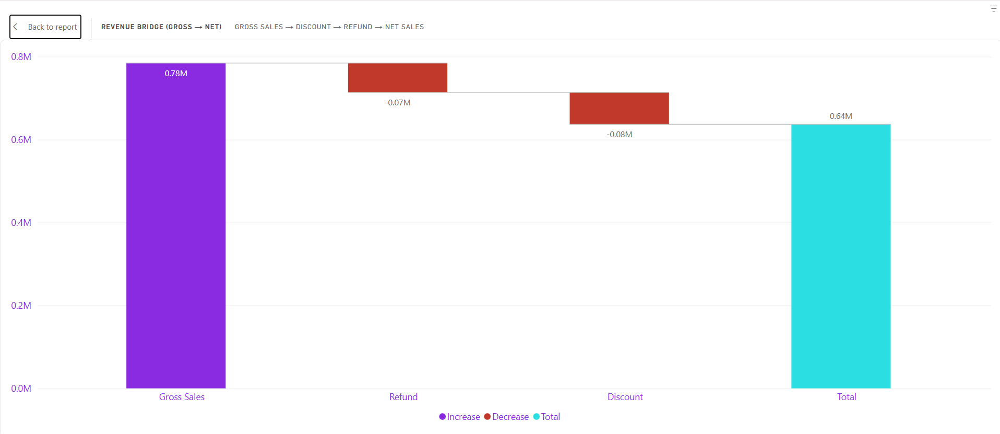
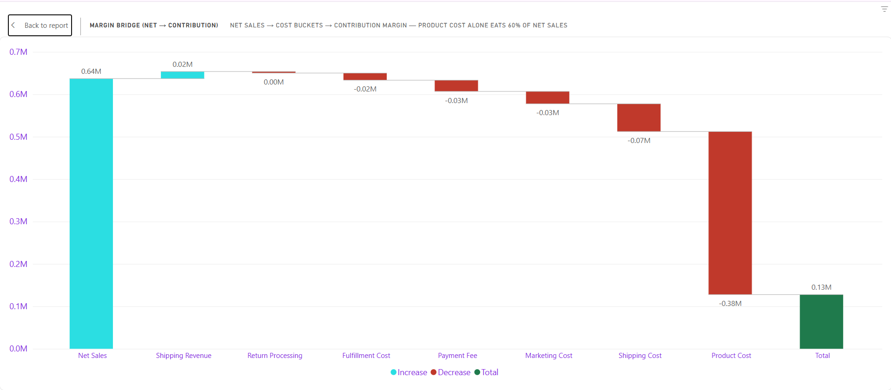
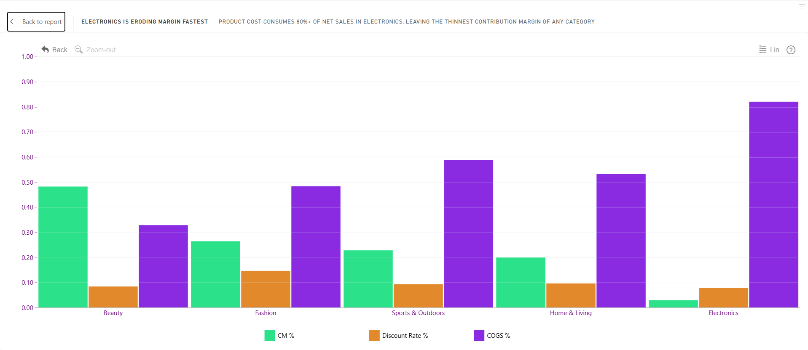
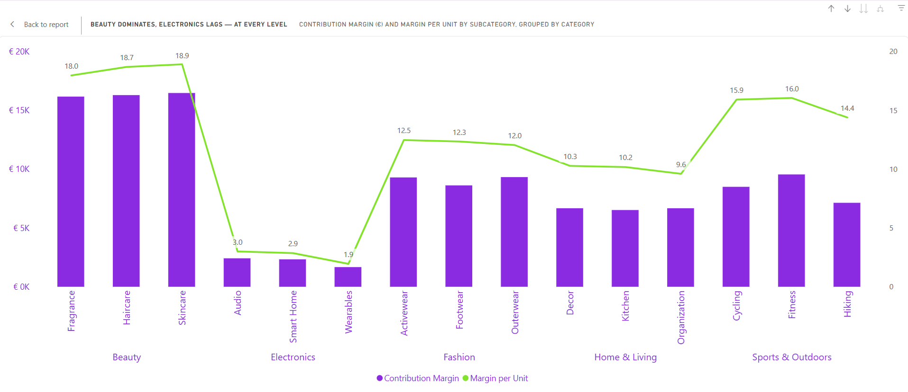
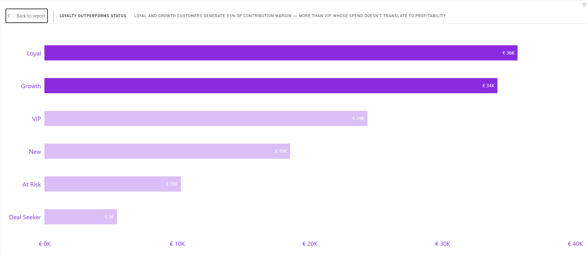
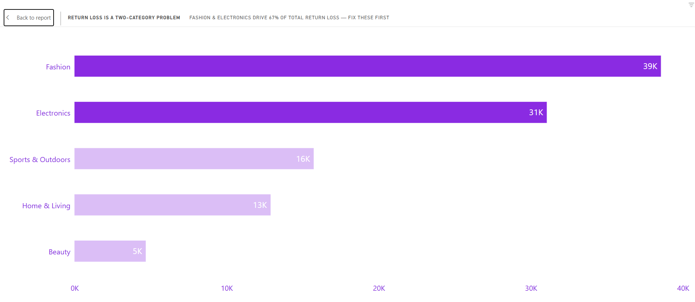

# ProfitLens: Ecommerce Profitability & Growth Analysis

### 🧩 Domain: Ecommerce / Retail Analytics (online retail — order lines, product categories, sales channels, customer cohorts, promotions, and carrier fulfillment)
### 💼 Function: Financial & Business Analytics — specifically Profitability / Margin Analysis (with strong overlap into FP&A-style work)
The core of the dashboard isn't "sales reporting," it's tracing Gross Sales → Net Sales → Contribution Margin and decomposing why margin erodes — cost structure, returns, customer economics, fulfillment cost-efficiency. That's the kind of analysis a Financial Analyst, BI Analyst, or Commercial/Revenue Analyst role would own.
### 🛠 Tools: Power BI (Power Query / M, DAX, Power BI Service), GitHub

**Live Dashboard:** [Click here](https://app.powerbi.com/view?r=eyJrIjoiYThmOWM4NDUtM2VlNS00YzBiLTk4YmUtOGY5ZThlMzQ2YzNjIiwidCI6IjQ2NTRiNmYxLTBlNDctNDU3OS1hOGExLTAyZmU5ZDk0M2M3YiIsImMiOjl9)

---

## 📌 Table of Contents
- <a href="#overview">Project Overview</a>
- <a href="#business-problem">Business Problem</a>
- <a href="#dataset">Dataset</a>
- <a href="#tools--technologies">Tools & Technologies</a>
- <a href="#data-model">Data Model</a>
- <a href="#primary-analysis">Primary Analysis</a>
- <a href="#dashboard">Dashboard</a>
- <a href="#key-learnings">Key Learnings</a>
- <a href="#how-to-explore">How to Explore</a>
- <a href="#author--contact">Author & Contact</a>

---

<h2>Overview</h2>
ProfitLens is an ecommerce profitability and growth dashboard built in Power BI. It uses custom DAX (bridge/waterfall measures, cohort aging, RFM-style segmentation) to trace revenue down to contribution margin and to show which levers actually move margin, and which ones only move volume.

---

<h2>Business Problem</h2>
Ecommerce revenue was growing, but leadership had no visibility into *where* margin was actually being made or lost — across products, channels, promotions, customer segments, and fulfillment partners. ProfitLens was built to answer: **which levers actually move contribution margin, and which ones just move volume?**

---

<h2>Dataset</h2>
The project uses ten tables: one fact table and nine dimension tables. They cover order lines, dates, products, customers, geography, promotions, fulfillment, sales channels, return reasons, and cohort age.

| Table | Type | Description |
|---|---|---|
| FactOrderLine | Fact | Order-line level sales, cost, and margin data |
| DimDate | Dimension | Calendar attributes for trend analysis |
| DimProduct | Dimension | Product and category attributes |
| DimCustomer | Dimension | Customer attributes and segments |
| DimGeography | Dimension | Market and location attributes |
| DimPromotion | Dimension | Promotion and discount details |
| DimFulfillment | Dimension | Fulfillment partner / carrier details |
| DimSalesChannel | Dimension | Sales and acquisition channels |
| DimReturnReason | Dimension | Reasons for returns |
| DimCohortAge | Dimension | Customer cohort age buckets |

[source : https://zoomcharts.com/en/microsoft-power-bi-custom-visuals/challenges/zoomcharts-power-bi-challenge-september-2026?loginSuccess=1]

---

<h2>Tools & Technologies</h2>

- Power BI (Power Query / M, DAX, Power BI Service)
- [SQL / Excel — add if used for source prep]
- GitHub

---

<h2>Data Model</h2>

A star schema with `FactOrderLine` at the center, connected to nine dimension tables (`DimDate`, `DimProduct`, `DimCustomer`, `DimGeography`, `DimPromotion`, `DimFulfillment`, `DimSalesChannel`, `DimReturnReason`, `DimCohortAge`) for efficient querying and optimized performance.

---

<h2>Primary Analysis</h2>

### Key Questions
1. Cost Structure: Where does revenue go between Gross Sales, Net Sales, and Contribution Margin?

### Data Visualization

*Figure 1.1: Revenue-to-NetSales Bridge*

*Figure 1.2: NetSales-to-Margin Bridge and Cost Decomposition*

### Key Insights / Findings
- **Product Cost alone consumes 60.3% of Net Sales**, leaving a **20.1% Contribution Margin**.

### Key Questions
2. Product Performance: Which categories drive sales, and which erode margin?

### Data Visualization

*Figure 2: Product Category Performance*

### Key Insights / Findings
- **Electronics drives strong sales but erodes margin fastest** of any category — volume is not translating into profit.

### Key Questions
3. Channel Efficiency: Which sales channels deliver margin, not just volume?

### Data Visualization

*Figure 3: Market and Channel Performance*

### Key Insights / Findings
- **Organic Search delivers near-Paid-Social volume at roughly double the margin.**

### Key Questions
4. Customer Segmentation: Which customer segments generate the most contribution margin?

### Data Visualization

*Figure 4: RFM-Style Customer Segments*

### Key Insights / Findings
- **Loyal + Growth segments generate 55% of contribution margin — more than VIP.**

### Key Questions
5. Returns: Where is return-related loss concentrated?

### Data Visualization

*Figure 5: Return Loss by Category*

### Key Insights / Findings
- **Fashion & Electronics account for 67% of total return-loss.**

---

<h2>Dashboard</h2>

1. **Executive Overview**
   Revenue/margin bridges, cost decomposition, and trend.
   - [Executive Overview Dashboard](images/executive_view.png)

2. **Growth Drivers**
   Product, market/channel, and promotion performance.
   - [Growth Drivers - Products Dashboard](images/growth_drivers_products.png)
   - [Growth Drivers - Markets & Channel Dashboard](images/growth_drivers_markets_channels.png)
   - [Growth Drivers - Promotion Dashboard](images/growth_drivers_promotions.png)

3. **Customers & Operations**
   Segmentation, cohorts, fulfillment, and returns.
   - [Customers & Operations - Returns Dashboard](images/customers_operations_returns.png)
   - [Customers & Operations - Customers & Cohort Dashboard](images/customers_operations_customers_cohorts.png)
   - [Customers & Operations - Fulfillment & Inventory Dashboard](images/customers_operations_fulfillment_inventory.png)

## Key Findings
- **Margin structure:** Product Cost (60.3% of Net Sales) is the dominant driver, leaving a 20.1% Contribution Margin.
- **Volume vs. margin:** Electronics and Paid Social bring volume but not proportional profit.
- **Where value sits:** Loyal + Growth customers and Organic Search contribute disproportionately to margin.
- **Leakage:** Returns are concentrated in Fashion and Electronics (67% of return-loss).

---

<h2>Key Learnings</h2>

- Built bridge/waterfall measures in DAX to trace Gross Sales → Net Sales → Contribution Margin.
- Cohort aging and RFM-style segmentation using custom DAX.
- Data preparation with Power Query (M).
- Publishing and sharing through Power BI Service.

---

<h2>How to Explore</h2>

1. Download `pbix/ProfitLens_Ecommerce_Dashboard.pbix`
2. Open in Power BI Desktop (free)
3. Or view static screenshots in `assets/screenshots/`

---

## Report
- [Project_Overview](report/ProfitLens_Analysis_Report.pdf)

---

<h2>Author & Contact</h2>

**Rita Mahato**
Data Analyst
📧 Email: ds.rita.mahato@gmail.com
🔗 [LinkedIn](https://www.linkedin.com/in/mahato-rita/)
🌐 [Portfolio](https://codebasics.io/portfolio/Rita-Mahato)
